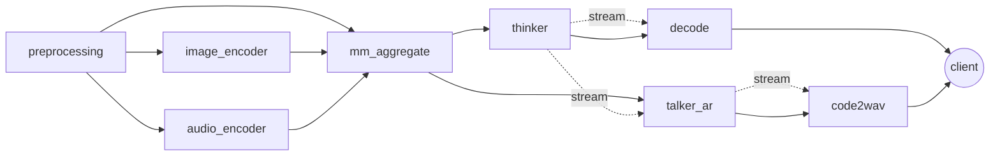
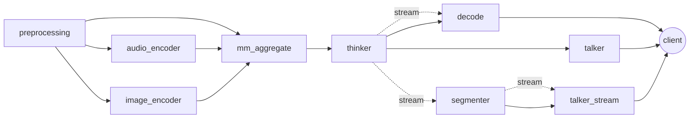

# Multimodal Prefix Cache Feasibility Notes

## Scope

This note covers only Qwen3-Omni and Ming-Omni on branch
`feat/omni-multimodal-prefix-cache`.

The current evidence combines source review, a lightweight synthetic probe that
executes the active request-builder/cache code paths, GPU-backed full-model
serving probes for repeated local image/audio/video input, and a measured-input
SLO scheduler simulation driven by those serving artifacts. The synthetic probe
is valid for cache-mechanics feasibility, while the serving probes give measured
latency and server-side prefix/cache trace evidence for text-output paths.

Raw probe artifacts:

- `logs/multimodal_prefix_cache_20260624_224411/results.json`
- `logs/multimodal_prefix_cache_20260624_224411/summary.md`
- `logs/benchmark_multimodal_prefix_cache_20260624_224653/client/qwen_repeated_media.json`
- `logs/benchmark_multimodal_prefix_cache_20260624_224653/client/qwen_repeated_media.md`
- `logs/benchmark_multimodal_prefix_cache_20260624_224653/client/qwen_first_attempt_failure.md`
- `logs/benchmark_multimodal_prefix_cache_20260624_224653/client/ming_repeated_media.json`
- `logs/benchmark_multimodal_prefix_cache_20260624_224653/client/ming_repeated_media.md`
- `logs/benchmark_multimodal_prefix_cache_20260624_224653/server/qwen_server.log`
- `logs/benchmark_multimodal_prefix_cache_20260624_224653/server/ming_server.log`
- `logs/benchmark_multimodal_prefix_cache_20260624_224653/sync/sync-main.txt`
- `logs/benchmark_multimodal_prefix_cache_20260624_224653/sync/sync-feature.txt`
- `logs/benchmark_multimodal_prefix_cache_av_20260624_230319/benchmark_summary.md`
- `logs/benchmark_multimodal_prefix_cache_av_20260624_230319/client/qwen_audio_repeated_media.json`
- `logs/benchmark_multimodal_prefix_cache_av_20260624_230319/client/qwen_video_repeated_media.json`
- `logs/benchmark_multimodal_prefix_cache_av_20260624_230319/client/ming_audio_repeated_media.json`
- `logs/benchmark_multimodal_prefix_cache_av_20260624_230319/client/ming_video_repeated_media_after_patch.json`
- `logs/benchmark_multimodal_slo_scheduler_20260624_232102/benchmark_summary.md`
- `logs/benchmark_multimodal_slo_scheduler_20260624_232102/results/measured_slo_target035/results.json`
- `logs/benchmark_multimodal_slo_scheduler_20260624_232102/results/measured_slo_target082/results.json`
- `logs/benchmark_multimodal_slo_scheduler_20260624_232102/results/measured_slo_target035_highcache/results.json`
- `logs/benchmark_multimodal_encoder_cache_after_fix_20260624_234242/benchmark_summary.md`
- `logs/benchmark_multimodal_encoder_cache_after_fix_20260624_234242/synthetic/prefix_cache_probe/results.json`
- `logs/benchmark_multimodal_encoder_cache_after_fix_20260624_234242/client/qwen_audio_repeated_media_after_fix.json`
- `logs/benchmark_multimodal_encoder_cache_after_fix_20260624_234242/client/ming_audio_repeated_media_after_fix.json`
- `logs/benchmark_multimodal_encoder_cache_after_fix_20260624_234242/client/ming_image_repeated_media_after_fix.json`
- `logs/benchmark_multimodal_encoder_cache_after_fix_20260624_234242/client/ming_video_repeated_media_after_fix.json`

Run command:

```bash
python scripts/experiments/multimodal_prefix_cache_probe.py --repeats 30
python scripts/experiments/multimodal_server_repeated_media_probe.py \
  --base-url http://127.0.0.1:8100 \
  --model qwen3-omni \
  --media-kind image \
  --media docs/_static/image/higgs-architecture.png \
  --alt-media docs/_static/image/moss-tts-arch-local.png \
  --cold-concurrency 4 \
  --repeats 4 \
  --stream \
  --max-tokens 16 \
  --output logs/benchmark_multimodal_prefix_cache_20260624_224653/client/qwen_repeated_media.json \
  --markdown-output logs/benchmark_multimodal_prefix_cache_20260624_224653/client/qwen_repeated_media.md
python scripts/experiments/multimodal_server_repeated_media_probe.py \
  --base-url http://127.0.0.1:8101 \
  --model ming-omni \
  --media-kind image \
  --media docs/_static/image/llada2.0_uni_architecture.png \
  --alt-media tests/data/cars.jpg \
  --cold-concurrency 4 \
  --repeats 4 \
  --stream \
  --max-tokens 16 \
  --output logs/benchmark_multimodal_prefix_cache_20260624_224653/client/ming_repeated_media.json \
  --markdown-output logs/benchmark_multimodal_prefix_cache_20260624_224653/client/ming_repeated_media.md
python scripts/experiments/multimodal_server_repeated_media_probe.py \
  --base-url http://127.0.0.1:8100 \
  --model qwen3-omni \
  --media-kind audio \
  --media tests/data/query_to_draw.wav \
  --alt-media tests/data/query_to_cars.wav \
  --prompt "What is said in the audio? Answer briefly." \
  --cold-concurrency 4 \
  --repeats 4 \
  --stream \
  --max-tokens 16 \
  --output logs/benchmark_multimodal_prefix_cache_av_20260624_230319/client/qwen_audio_repeated_media.json \
  --markdown-output logs/benchmark_multimodal_prefix_cache_av_20260624_230319/client/qwen_audio_repeated_media.md
python scripts/experiments/multimodal_server_repeated_media_probe.py \
  --base-url http://127.0.0.1:8101 \
  --model ming-omni \
  --media-kind video \
  --media tests/data/draw.mp4 \
  --prompt "Describe this video in one short sentence." \
  --cold-concurrency 4 \
  --repeats 4 \
  --stream \
  --max-tokens 16 \
  --video-fps 1 \
  --video-max-frames 8 \
  --video-max-pixels 200704 \
  --output logs/benchmark_multimodal_prefix_cache_av_20260624_230319/client/ming_video_repeated_media_after_patch.json \
  --markdown-output logs/benchmark_multimodal_prefix_cache_av_20260624_230319/client/ming_video_repeated_media_after_patch.md
python scripts/experiments/multimodal_measured_slo_scheduler_probe.py \
  --output-dir logs/benchmark_multimodal_slo_scheduler_20260624_232102/results/measured_slo_target035 \
  --requests 100000 \
  --workers 2 \
  --target-utilization 0.35 \
  --seed 20260624 \
  --warmup-requests 10000 \
  --zipf-skew 1.05
python scripts/experiments/multimodal_measured_slo_scheduler_probe.py \
  --output-dir logs/benchmark_multimodal_slo_scheduler_20260624_232102/results/measured_slo_target082 \
  --requests 100000 \
  --workers 2 \
  --target-utilization 0.82 \
  --seed 20260624 \
  --warmup-requests 10000 \
  --zipf-skew 1.05
python scripts/experiments/multimodal_measured_slo_scheduler_probe.py \
  --output-dir logs/benchmark_multimodal_slo_scheduler_20260624_232102/results/measured_slo_target035_highcache \
  --requests 100000 \
  --workers 2 \
  --target-utilization 0.35 \
  --seed 20260624 \
  --warmup-requests 10000 \
  --zipf-skew 1.05 \
  --cache-capacity audio=8192,image=4096,video=1024
python scripts/experiments/multimodal_prefix_cache_probe.py \
  --output-dir logs/benchmark_multimodal_encoder_cache_after_fix_20260624_234242/synthetic/prefix_cache_probe \
  --repeats 10
python scripts/experiments/multimodal_server_repeated_media_probe.py \
  --base-url http://127.0.0.1:8100 \
  --model qwen3-omni \
  --media-kind audio \
  --media tests/data/query_to_draw.wav \
  --alt-media tests/data/query_to_cars.wav \
  --prompt "What is said in the audio? Answer briefly." \
  --cold-concurrency 4 \
  --repeats 4 \
  --stream \
  --max-tokens 16 \
  --output logs/benchmark_multimodal_encoder_cache_after_fix_20260624_234242/client/qwen_audio_repeated_media_after_fix.json \
  --markdown-output logs/benchmark_multimodal_encoder_cache_after_fix_20260624_234242/client/qwen_audio_repeated_media_after_fix.md
python scripts/experiments/multimodal_server_repeated_media_probe.py \
  --base-url http://127.0.0.1:8101 \
  --model ming-omni \
  --media-kind image \
  --media docs/_static/image/llada2.0_uni_architecture.png \
  --alt-media tests/data/cars.jpg \
  --prompt "Describe the image briefly." \
  --cold-concurrency 4 \
  --repeats 4 \
  --stream \
  --max-tokens 16 \
  --output logs/benchmark_multimodal_encoder_cache_after_fix_20260624_234242/client/ming_image_repeated_media_after_fix.json \
  --markdown-output logs/benchmark_multimodal_encoder_cache_after_fix_20260624_234242/client/ming_image_repeated_media_after_fix.md
```

Environment captured by the probe:

- synthetic probe commit: `86e73bdb` with probe files still untracked
- full-model serving probe post-sync commit: `c879d561`
- Python: `3.12.3`
- GPUs visible: 8 x H100 80GB, idle at collection time
- Qwen serving run: GPU 0, `Qwen/Qwen3-Omni-30B-A3B-Instruct`, text-output
  mode, image input, `SGLANG_OMNI_TRACE_ENCODER_CACHE=1`
- Ming serving run: GPUs 2-5, `inclusionAI/Ming-flash-omni-2.0`, thinker
  TP=4, text-output mode, image input
- follow-up audio/video serving probe commit before code fix: `a2cb475c`
- follow-up audio/video serving probe included a Ming video compatibility fix
  validated before rerunning Ming video
- measured-input SLO scheduler probe started from commit `4b61fcf1`; the
  simulator/report additions are included in the follow-up commit. It is
  CPU-only and uses the committed serving JSON artifacts as measured TTFT inputs
- after-fix encoder cache probe commit: `59af39b6`; Qwen and Ming serving runs
  used `SGLANG_OMNI_TRACE_ENCODER_CACHE=1`

## Current Code Path

### Qwen3-Omni

Pipeline shape:



Key source evidence:

- `sglang_omni/models/qwen3_omni/config.py:25` routes preprocessing to
  `image_encoder`, `audio_encoder`, and `mm_aggregate`.
- `sglang_omni/models/qwen3_omni/config.py:79` makes `mm_aggregate` wait for
  preprocessing plus active encoders and merge via `merge_for_thinker`.
- `sglang_omni/models/qwen3_omni/config.py:109` streams thinker output to
  decode and, for speech, `talker_ar`.
- `sglang_omni/models/qwen3_omni/components/preprocessor.py:343` builds media
  cache keys before media conversion and contextualizes video/audio parameters.
- `sglang_omni/models/qwen3_omni/merge.py:151` passes modality-prefixed
  `media_cache_keys` into thinker inputs.
- `sglang_omni/models/qwen3_omni/request_builders.py:534` hashes media keys into
  stable out-of-vocab pad values and substitutes generic media placeholder token
  IDs in `Req.origin_input_ids`.
- `sglang_omni/models/qwen3_omni/stages.py:316` uses `StageOutputCache` for
  encoder output lookup/store.
- `sglang_omni/models/qwen3_omni/stages.py:373` deduplicates same-batch image
  encoder requests by cache key.
- `sglang_omni/models/qwen3_omni/stages.py:636` batches audio encoder requests
  and now deduplicates duplicate audio cache keys inside the same cold batch.

### Ming-Omni

Pipeline shape:



Key source evidence:

- `sglang_omni/models/ming_omni/config.py:49` defines preprocessing fan-out to
  audio/image encoders and aggregate.
- `sglang_omni/models/ming_omni/config.py:94` defines aggregate fan-in and
  merge to thinker.
- `sglang_omni/models/ming_omni/config.py:117` adds the streaming speech path
  through `segmenter` and `talker_stream`.
- `sglang_omni/models/ming_omni/components/preprocessor.py:393` computes media
  cache keys before async media loading.
- `sglang_omni/models/ming_omni/components/preprocessor.py:544` always creates
  audio/image encoder input keys so aggregate receives all configured sources.
- `sglang_omni/models/ming_omni/pipeline/merge.py:119` forwards
  modality-prefixed `media_cache_keys`.
- `sglang_omni/models/ming_omni/bootstrap.py:135` hashes media keys into stable
  out-of-vocab pad values and substitutes generic media placeholder token IDs in
  `Req.origin_input_ids`.
- `sglang_omni/models/ming_omni/stages.py:207` wraps active encoder payloads
  with model-local `StageOutputCache` lookup/store logic.
- `sglang_omni/models/ming_omni/stages.py:310` and
  `sglang_omni/models/ming_omni/stages.py:334` wire that cache into active
  audio and image encoder factories.

## Probe Results

### Prefix Keying

The probe constructs Qwen3 and Ming `Req.origin_input_ids` through the active
request-builder paths. It compares common-prefix lengths with raw generic media
placeholder IDs versus keyed out-of-vocab media IDs.

| Model | Case | Prompt tokens | Raw common prefix | Keyed common prefix | Keyed reuse | Unsafe raw reuse avoided |
| --- | --- | ---: | ---: | ---: | ---: | ---: |
| Qwen3-Omni | same media, different question | 35 | 31 | 31 | 88.57% | 0 |
| Qwen3-Omni | different image, same placeholder shape | 35 | 35 | 2 | 5.71% | 33 |
| Qwen3-Omni | different audio, same placeholder shape | 35 | 35 | 19 | 54.29% | 16 |
| Qwen3-Omni | different video decode params, same shape | 26 | 26 | 2 | 7.69% | 24 |
| Ming-Omni | same media, different question | 35 | 31 | 31 | 88.57% | 0 |
| Ming-Omni | different image, same placeholder shape | 35 | 35 | 2 | 5.71% | 33 |
| Ming-Omni | different audio, same placeholder shape | 35 | 35 | 19 | 54.29% | 16 |
| Ming-Omni | different video decode params, same shape | 26 | 26 | 2 | 7.69% | 24 |

Interpretation:

- Same-media prompts keep the multimodal prefix reusable. In the 35-token
  synthetic prompt, 31 tokens remain cacheable across different questions.
- Different media with identical placeholder counts no longer falsely share the
  whole prompt. The keyed path cuts common prefix to the text before the changed
  media segment.
- Video decode parameters are part of the video key, so same video bytes decoded
  with different fps/max-frame settings do not alias.

### Encoder Cache

The encoder-cache probe uses synthetic encoder modules that sleep 3 ms per
batched forward. The numbers measure the active batching/cache mechanics, not
real model FLOPs.

| Model | Stage | Cold calls | Warm calls | Cold processed units | Warm processed units | Cold median ms | Warm median ms | Warm speedup | Same-batch duplicate reduction |
| --- | --- | ---: | ---: | ---: | ---: | ---: | ---: | ---: | ---: |
| Qwen3-Omni | image_encoder | 1 | 0 | 8 visual tokens | 0 | 3.1442 | 0.0234 | 134.37x | 33.33% |
| Qwen3-Omni | audio_encoder | 1 | 0 | 3 audio rows | 0 | 3.1455 | 0.0219 | 143.63x | 0.00% |

Interpretation:

- Qwen3 image encoder has both warm-cache skip and same-batch duplicate
  elimination. In a 3-request batch with one duplicate image key, synthetic
  visual-token work drops from 12 to 8 tokens on the cold batch, then to 0 on
  warm cache.
- Qwen3 audio encoder has warm-cache skip but no same-batch duplicate
  elimination. A matching same-batch dedup pass would remove 1 of 3 audio rows
  in this probe.
- Ming encoder cache is not wired on the active path. For 10 repeated media
  requests, current source implies 10 encoder forwards; a Qwen-style
  `StageOutputCache` would reduce that to 1, an avoidable 90% repeated-encoder
  forward ratio under this repeated-media workload.

After commit `59af39b6`, the synthetic probe was rerun with the fixed Qwen audio
and Ming active encoder paths:

| Model | Stage | Cold calls | Warm calls | Cold processed units | Warm processed units | Warm speedup | Same-batch duplicate reduction |
| --- | --- | ---: | ---: | ---: | ---: | ---: | ---: |
| Qwen3-Omni | image_encoder | 1 | 0 | 8 visual tokens | 0 | 137.34x | 33.33% |
| Qwen3-Omni | audio_encoder | 1 | 0 | 2 audio rows | 0 | 147.16x | 33.33% |
| Ming-Omni | audio_encoder | 1 | N/A | 10 repeated requests | N/A | N/A | 90.00% avoidable forwards removed |
| Ming-Omni | image_encoder | 1 | N/A | 10 repeated requests | N/A | N/A | 90.00% avoidable forwards removed |

The Qwen audio cold batch now computes only the two unique audio keys from the
3-request synthetic batch. Ming audio/image now compute once for 10 repeated
payloads in the model-local helper probe.

### Full-Model Serving Probe

The serving probe launches the real servers and sends streamed
`/v1/chat/completions` image-input/text-output requests. Each run sends 4
simultaneous same-image requests, 4 warm sequential same-image requests, and 1
different-image request. The client measures end-to-end request latency and
first streamed text delta. Server logs provide the cache evidence.

Qwen3-Omni launch:

```bash
CUDA_VISIBLE_DEVICES=0 SGLANG_OMNI_TRACE_ENCODER_CACHE=1 \
  /data/.venv/bin/python -m sglang_omni.cli serve \
  --model-path Qwen/Qwen3-Omni-30B-A3B-Instruct \
  --model-name qwen3-omni \
  --text-only \
  --host 127.0.0.1 \
  --port 8100
```

Ming-Omni launch:

```bash
CUDA_VISIBLE_DEVICES=2,3,4,5 \
  /data/.venv/bin/python -m sglang_omni.cli serve \
  --model-path inclusionAI/Ming-flash-omni-2.0 \
  --model-name ming-omni \
  --text-only \
  --host 127.0.0.1 \
  --port 8101 \
  --thinker-tp-size 4 \
  --thinker-gpus 0,1,2,3 \
  --mem-fraction-static 0.80
```

Client timing:

| Model | Phase | Requests | Success | Mean latency s | p50 latency s | p95 latency s | Mean first delta s |
| --- | --- | ---: | ---: | ---: | ---: | ---: | ---: |
| Qwen3-Omni | cold concurrent same image | 4 | 4 | 0.558 | 0.560 | 0.560 | 0.433 |
| Qwen3-Omni | warm sequential same image | 4 | 4 | 0.264 | 0.264 | 0.274 | 0.180 |
| Qwen3-Omni | single different image | 1 | 1 | 0.615 | 0.615 | 0.615 | 0.531 |
| Ming-Omni | cold concurrent same image | 4 | 4 | 5.707 | 5.705 | 5.720 | 4.948 |
| Ming-Omni | warm sequential same image | 4 | 4 | 0.612 | 0.601 | 0.660 | 0.496 |
| Ming-Omni | single different image | 1 | 1 | 0.883 | 0.883 | 0.883 | 0.767 |

Server-side cache/prefix evidence:

| Model | Phase | Server evidence |
| --- | --- | --- |
| Qwen3-Omni | cold concurrent same image | image encoder `miss` + `store` for the first request, then 3 `hit` records for the same image key; SGLang prefill saw `#new-token: 1484, #cached-token: 4` then `#new-token: 3, #cached-token: 4461` for the remaining 3 requests |
| Qwen3-Omni | warm sequential same image | 4 image encoder `hit` records; each prefill saw `#new-token: 1, #cached-token: 1487` |
| Qwen3-Omni | single different image | image encoder `miss` + `store`; prefill saw `#new-token: 3263, #cached-token: 4` |
| Ming-Omni | cold concurrent same image | no encoder-cache trace records; SGLang prefill saw `#new-token: 986, #cached-token: 0` for the first request, then `#new-token: 3, #cached-token: 2955` for the remaining 3 requests |
| Ming-Omni | warm sequential same image | no encoder-cache trace records; each prefill saw `#new-token: 1, #cached-token: 985` |
| Ming-Omni | single different image | no encoder-cache trace records; prefill saw `#new-token: 939, #cached-token: 21` |

Interpretation:

- Qwen3 has measured real-server evidence for both non-AR image encoder output
  cache hits and SGLang prefix/KV reuse. The warmed same-image phase reduced
  mean latency from 0.558 s to 0.264 s and mean first-delta latency from 0.433 s
  to 0.180 s.
- The first Qwen concurrent group did not emit `dedup_same_batch`; one request
  computed and stored the encoder output, then the other concurrent requests hit
  the cache after the store. The effect is still one real image encoder forward
  for 4 same-image requests in the observed run.
- Ming has measured real-server evidence for prefix/KV reuse, but not active
  encoder-output cache reuse. The warmed same-image phase reduced mean latency
  from 5.707 s to 0.612 s and mean first-delta latency from 4.948 s to 0.496 s,
  while server logs showed only SGLang prefill cached-token counters.
- The different-image requests retained only small text/system prefix reuse,
  confirming that media-keyed placeholder substitution prevents unsafe reuse of
  the multimodal media span.

### Audio/Video Serving Probe

A follow-up serving probe extended the repeated-media measurement to audio and
video input. The run used the same client driver and server APIs, with 4
concurrent cold same-media requests and 4 warm sequential same-media requests.
Audio also included a single different-media request. Video used
`tests/data/draw.mp4` with `video_fps=1`, `video_max_frames=8`, and
`video_max_pixels=200704`.

Client timing:

| Model | Media | Phase | Requests | Success | Mean latency s | p50 latency s | Mean first delta s |
| --- | --- | --- | ---: | ---: | ---: | ---: | ---: |
| Qwen3-Omni | audio | cold concurrent same media | 4 | 4 | 1.372 | 1.372 | 1.267 |
| Qwen3-Omni | audio | warm sequential same media | 4 | 4 | 0.229 | 0.162 | 0.177 |
| Qwen3-Omni | audio | single different media | 1 | 1 | 0.637 | 0.637 | 0.592 |
| Qwen3-Omni | video | cold concurrent same media | 4 | 4 | 5.810 | 5.664 | 5.758 |
| Qwen3-Omni | video | warm sequential same media | 4 | 4 | 2.220 | 2.217 | 2.169 |
| Ming-Omni | audio | cold concurrent same media | 4 | 4 | 2.225 | 2.225 | 1.797 |
| Ming-Omni | audio | warm sequential same media | 4 | 4 | 0.231 | 0.226 | 0.200 |
| Ming-Omni | audio | single different media | 1 | 1 | 0.281 | 0.281 | 0.221 |
| Ming-Omni | video pre-patch | cold/warm same media | 8 | 0 | N/A | N/A | N/A |
| Ming-Omni | video after patch | cold concurrent same media | 4 | 4 | 7.052 | 6.816 | 6.305 |
| Ming-Omni | video after patch | warm sequential same media | 4 | 4 | 2.154 | 2.157 | 2.041 |

Server-side cache/prefix evidence:

| Model | Media | Server evidence |
| --- | --- | --- |
| Qwen3-Omni | audio | cold same-audio requests emitted 4 `audio_encoder` misses and 4 stores; warm same-audio requests emitted 4 hits; prefix counters moved from `#new-token: 172, #cached-token: 0` / `#new-token: 2, #cached-token: 170` in the cold group to `#new-token: 1, #cached-token: 85` for each warm repeat |
| Qwen3-Omni | video | cold same-video requests emitted 1 image/video encoder miss/store and 3 hits; warm repeats emitted 4 hits; prefix counters moved from `#new-token: 555, #cached-token: 3` on the first request to `#new-token: 1, #cached-token: 557` on repeats |
| Ming-Omni | audio | no encoder-cache records; prefix counters moved from `#new-token: 165, #cached-token: 0` / `#new-token: 3, #cached-token: 492` in the cold group to `#new-token: 1, #cached-token: 164` for each warm repeat |
| Ming-Omni | video | pre-patch requests failed in preprocessing because installed `Qwen2VLImageProcessor` rejects `videos=`; after patch, no such failures appeared and prefix counters moved from `#new-token: 1290, #cached-token: 0` to `#new-token: 1, #cached-token: 1289` on repeats |

Interpretation:

- Qwen3 audio has real-server warm encoder-cache hits, but the cold concurrent
  group confirms the earlier synthetic gap: same-batch audio duplicates are not
  coalesced, so four identical cold audio requests all computed and stored.
- Qwen3 video reuses the image/video encoder cache through the image encoder
  stage. Warm repeats still take about 2.2 s because video preprocessing and
  decode/preprocess overhead remain substantial even after AR prefix reuse.
- Ming audio/video show strong AR prefix/KV reuse but no active encoder-output
  cache telemetry, reinforcing the Ming `StageOutputCache` gap.
- Ming video needed a runtime compatibility fix: when the installed
  `Qwen2VLImageProcessor` lacks `videos=` support, the preprocessor now falls
  back to frame-list processing and reconstructs per-video `video_grid_thw`.

### After-Fix Encoder Cache Serving Probe

Commit `59af39b6` closed the Qwen audio same-batch dedup gap and wired Ming
active audio/image encoder stages to `StageOutputCache`. The after-fix serving
run used the same repeated-media client shape as above.

Client timing:

| Model | Media | Phase | Requests | Success | Mean latency s | p50 latency s | Mean first delta s |
| --- | --- | --- | ---: | ---: | ---: | ---: | ---: |
| Qwen3-Omni | audio | cold concurrent same media | 4 | 4 | 1.289 | 1.287 | 1.217 |
| Qwen3-Omni | audio | warm sequential same media | 4 | 4 | 0.134 | 0.133 | 0.106 |
| Qwen3-Omni | audio | single different media | 1 | 1 | 0.213 | 0.213 | 0.166 |
| Ming-Omni | audio | cold concurrent same media | 4 | 4 | 2.167 | 2.167 | 1.734 |
| Ming-Omni | audio | warm sequential same media | 4 | 4 | 0.223 | 0.211 | 0.191 |
| Ming-Omni | audio | single different media | 1 | 1 | 0.276 | 0.276 | 0.215 |
| Ming-Omni | image | cold concurrent same media | 4 | 4 | 4.256 | 4.256 | 3.871 |
| Ming-Omni | image | warm sequential same media | 4 | 4 | 0.679 | 0.678 | 0.558 |
| Ming-Omni | image | single different media | 1 | 1 | 0.705 | 0.705 | 0.586 |
| Ming-Omni | video | cold concurrent same media | 4 | 4 | 4.796 | 4.815 | 4.678 |
| Ming-Omni | video | warm sequential same media | 4 | 4 | 2.219 | 2.209 | 2.101 |

Server-side cache evidence:

| Model | Media | Server evidence after fix |
| --- | --- | --- |
| Qwen3-Omni | audio | Cold same-audio group emitted one real store, 3 `dedup_same_batch` records, and later 4 warm hits. The different-audio request emitted a separate miss/store. |
| Ming-Omni | audio | Cold same-audio group emitted one miss/store followed by 3 hits; warm same-audio emitted 4 hits; different audio emitted a separate miss/store. |
| Ming-Omni | image | Cold same-image group emitted one miss/store followed by 3 hits; warm same-image emitted 4 hits; different image emitted a separate miss/store. |
| Ming-Omni | video | Video uses the image encoder path after preprocessing; cold same-video emitted one miss/store followed by hits, and warm same-video emitted hits. Video preprocessing still dominates warm latency. |

This closes the two concrete encoder-cache gaps found by the earlier probes.
The remaining performance issue for video is upstream preprocessing/decode cost:
the encoder output is cached, but the repeated video fixture still spends about
1.3-1.4 s per request in frame extraction before the image encoder cache hit.

### SLO Scheduling Simulation

The scheduling simulation is deterministic and synthetic. It models 5,000
requests, 2 workers, mixed audio/text/video arrivals, modality-specific service
times, cache-hit probabilities, and SLO deadlines. It is a direction check for
hybrid SLO-aware scheduling, not a production benchmark.

| Strategy | Deadline miss | Audio miss | Video miss | p50 ms | p95 ms | p99 ms | Mean ms |
| --- | ---: | ---: | ---: | ---: | ---: | ---: | ---: |
| FIFO | 4.76% | 10.33% | 0.00% | 28.3358 | 112.4192 | 158.5473 | 42.1834 |
| EDF | 0.10% | 0.22% | 0.00% | 20.0000 | 113.0682 | 211.2878 | 34.3515 |
| Hybrid SLO + cache | 0.02% | 0.04% | 0.00% | 20.0000 | 97.8369 | 198.9059 | 33.2316 |

Interpretation:

- A simple deadline-aware policy reduces synthetic audio miss rate from 10.33%
  to 0.22%.
- Adding cache-hit bias reduces the miss rate further to 0.04% and improves p95
  latency in this workload.
- This supports feasibility of mixed SLO scheduling as a control-plane policy,
  but the numbers must be replaced by profiler-backed stage service times before
  making deployment claims.

### Measured-Input SLO Scheduling Probe

The measured-input scheduler probe replaces the hand-picked service times above
with streaming first-delta latency from the Qwen3-Omni and Ming-Omni
repeated-media serving artifacts. It simulates 100,000 requests per model,
2 workers per model, audio/image/video mix 50%/30%/20%, Zipf media locality,
10,000 warmup arrivals, and first-delta SLOs of 600 ms for audio, 1200 ms for
image, and 3500 ms for video. It is still a queueing simulation, not a live
Stage runtime benchmark.

Measured TTFT inputs:

| Model | Modality | Cold TTFT ms | Warm TTFT ms | Speedup |
| --- | --- | ---: | ---: | ---: |
| Qwen3-Omni | image | 444.6335 | 180.3376 | 2.47x |
| Qwen3-Omni | audio | 1287.0211 | 177.4352 | 7.25x |
| Qwen3-Omni | video | 3135.5938 | 2168.6994 | 1.45x |
| Ming-Omni | image | 5237.5639 | 496.0815 | 10.56x |
| Ming-Omni | audio | 1862.3025 | 199.5327 | 9.33x |
| Ming-Omni | video | 5271.7307 | 2040.5090 | 2.58x |

Default cache capacity, 0.35 target utilization:

| Model | Strategy | Offered load | Hit rate | Deadline miss | Audio miss | P95 queue ms |
| --- | --- | ---: | ---: | ---: | ---: | ---: |
| Qwen3-Omni | FIFO, no cache | 0.710 | 0.00% | 71.73% | 100.00% | 4171.5765 |
| Qwen3-Omni | FIFO, cache | 0.350 | 83.99% | 11.72% | 18.04% | 1034.8995 |
| Qwen3-Omni | EDF, cache | 0.350 | 83.99% | 11.18% | 17.04% | 930.5374 |
| Qwen3-Omni | cache-weighted EDF | 0.350 | 83.99% | 11.02% | 16.91% | 915.0651 |
| Ming-Omni | FIFO, no cache | 1.046 | 0.00% | 100.00% | 100.00% | 7203359.0918 |
| Ming-Omni | FIFO, cache | 0.350 | 84.01% | 25.23% | 21.30% | 1746.8141 |
| Ming-Omni | EDF, cache | 0.350 | 84.01% | 24.65% | 20.32% | 1560.9703 |
| Ming-Omni | cache-weighted EDF | 0.350 | 84.01% | 24.52% | 20.12% | 1571.8367 |

Default cache capacity, 0.82 target utilization:

| Model | Strategy | Offered load | Hit rate | Deadline miss | Audio miss | P95 queue ms |
| --- | --- | ---: | ---: | ---: | ---: | ---: |
| Qwen3-Omni | FIFO, no cache | 1.664 | 0.00% | 100.00% | 100.00% | 26404043.0286 |
| Qwen3-Omni | FIFO, cache | 0.820 | 83.99% | 58.82% | 66.09% | 6572.2627 |
| Qwen3-Omni | EDF, cache | 0.820 | 83.99% | 51.86% | 56.25% | 5541.0796 |
| Qwen3-Omni | cache-weighted EDF | 0.820 | 83.99% | 52.10% | 56.59% | 5602.9622 |
| Ming-Omni | FIFO, no cache | 2.450 | 0.00% | 100.00% | 100.00% | 99635752.3012 |
| Ming-Omni | FIFO, cache | 0.820 | 84.01% | 69.81% | 70.95% | 11832.8650 |
| Ming-Omni | EDF, cache | 0.820 | 84.01% | 66.95% | 65.66% | 11384.6920 |
| Ming-Omni | cache-weighted EDF | 0.820 | 84.01% | 67.50% | 66.77% | 10889.5594 |

High cache-capacity sensitivity at 0.35 target utilization raises synthetic hit
rate to about 96%. Under cache-weighted EDF, Qwen3-Omni deadline miss falls to
8.00% and Ming-Omni to 10.03%. This shows the dominant lever is cache-hit rate;
the scheduling policy gives modest but measurable reductions when the workload
is not already queue dominated.

Measured-input interpretation:

- Cache is mandatory for the selected realtime SLOs. No-cache Qwen3-Omni still
  misses 71.73% at the 0.35 load point, and no-cache Ming-Omni is unstable even
  there because cold image/audio/video TTFT exceeds the selected SLOs.
- EDF/cache-weighted EDF helps at moderate load but is not a rescue mechanism.
  At 0.35 load, cache-weighted EDF improves Qwen3-Omni miss rate by 0.70
  percentage points over FIFO-cache and Ming-Omni by 0.71 points.
- At 0.82 load, queueing dominates. Qwen3-Omni remains above 50% miss and
  Ming-Omni above 66% miss even with EDF/cache-weighted EDF.
- A unified SLO scheduler is feasible as a control-plane policy, but a credible
  realtime system also needs high cache hit rate, in-flight duplicate
  coalescing, backpressure/capacity control, and profiler-backed stage service
  estimates.

## Feasibility Conclusion

The cache part is feasible and already partially implemented:

- Qwen3-Omni has a working two-level pattern: non-AR encoder output cache plus
  SGLang radix prefix cache made multimodal-safe by content-keyed placeholder
  substitution. The serving probes validate this on real image, audio, and
  video input paths. After commit `59af39b6`, audio same-batch duplicate
  requests are coalesced before the encoder forward.
- Ming-Omni has the radix-safety part on the active thinker path and now has
  active audio/image encoder-output cache reuse. The after-fix serving probe
  validates prefix/KV reuse plus encoder-output reuse across image, audio, and
  video-through-image-encoder paths.
- The media-key approach handles the key correctness problem that would otherwise
  make generic `<imagePatch>` / `<audioPatch>` / `<videoPatch>` placeholders
  unsafe for radix prefix caching.

The scheduling part is feasible as a next framework layer, but not implemented:

- Current stage configs already expose modality-separated stages, stream edges,
  fan-in waits, and terminal stages, which gives enough structure for a scheduler
  to attach modality-specific SLOs.
- The current code does not have a unified SLO-aware scheduler across stages,
  backpressure, cache-admission policy, or distributed cache namespace.
- The synthetic scheduler result shows directionally large benefit for audio SLO
  misses. The measured-input scheduler probe is stricter: it shows cache and
  deadline-aware scheduling are necessary, but scheduler priority alone cannot
  meet strict realtime SLOs when cold multimodal TTFT exceeds the deadline or
  when queueing dominates.

## Engineering Gaps

1. Closed: Ming encoder cache parity.
   `StageOutputCache` is now wired into active Ming audio/image encoder
   factories. The after-fix serving logs show miss/store/hit traces for audio,
   image, and video-through-image-encoder requests.

2. Closed: Qwen3 audio same-batch dedup.
   `_batch_audio_encoder_payloads` now mirrors image-encoder duplicate
   coalescing. The after-fix audio serving probe produced one real cold store,
   three same-batch dedup records, and warm hits.

3. Unified cache identity schema.
   Include model id/revision, modality, preprocessing parameters, encoder
   implementation version, dtype, and output-shape contract in keys. Current
   Qwen3/Ming keys cover content and selected preprocessing knobs, but not every
   deployment/version dimension.

4. Cache telemetry.
   Promote hit/miss/store/evict counters to structured profiler events so
   formal runs can attribute TTFT and memory changes to cache behavior.

5. SLO scheduler.
   Add a policy layer that can prioritize audio-latency-sensitive work, bound
   video memory pressure, and account for cache-hit probability without changing
   Stage or Coordinator tensor/control-plane boundaries. The measured-input
   probe suggests EDF/cache-weighted EDF should be paired with admission control:
   at 0.82 target utilization, deadline misses remain above 50% for Qwen3-Omni
   and above 66% for Ming-Omni.

6. Broader streaming validation.
   Add structured request-profiler events and run mixed-modality text+audio
   output or realtime websocket traffic, then compare profiler-backed TTFT,
   encoder time, prefix-hit length, HBM usage, and deadline miss rate under
   repeated media plus mixed-modality streaming traffic.
