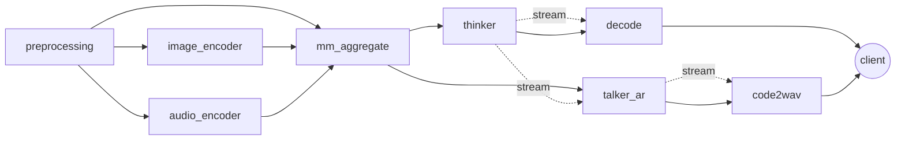
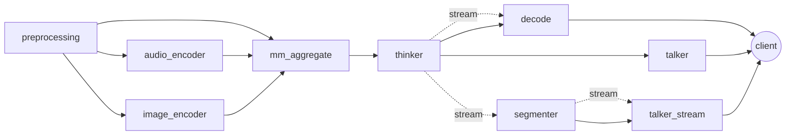

# Multimodal Prefix Cache Feasibility Notes

## Scope

This note covers only Qwen3-Omni and Ming-Omni on branch
`feat/omni-multimodal-prefix-cache`.

The current evidence combines source review, a lightweight synthetic probe that
executes the active request-builder/cache code paths, and a GPU-backed
full-model serving probe for repeated local image input. The synthetic probe is
valid for cache-mechanics feasibility, while the serving probe gives measured
latency and server-side prefix/cache trace evidence for the image-input,
text-output path.

Raw probe artifacts:

- `logs/multimodal_prefix_cache_20260624_224411/results.json`
- `logs/multimodal_prefix_cache_20260624_224411/summary.md`
- `logs/benchmark_multimodal_prefix_cache_20260624_224653/client/qwen_repeated_media.json`
- `logs/benchmark_multimodal_prefix_cache_20260624_224653/client/qwen_repeated_media.md`
- `logs/benchmark_multimodal_prefix_cache_20260624_224653/client/qwen_first_attempt_failure.md`
- `logs/benchmark_multimodal_prefix_cache_20260624_224653/client/ming_repeated_media.json`
- `logs/benchmark_multimodal_prefix_cache_20260624_224653/client/ming_repeated_media.md`
- `logs/benchmark_multimodal_prefix_cache_20260624_224653/server/qwen_server.log`
- `logs/benchmark_multimodal_prefix_cache_20260624_224653/server/ming_server.log`
- `logs/benchmark_multimodal_prefix_cache_20260624_224653/sync/sync-main.txt`
- `logs/benchmark_multimodal_prefix_cache_20260624_224653/sync/sync-feature.txt`

Run command:

```bash
python scripts/experiments/multimodal_prefix_cache_probe.py --repeats 30
python scripts/experiments/multimodal_server_repeated_media_probe.py \
  --base-url http://127.0.0.1:8100 \
  --model qwen3-omni \
  --media-kind image \
  --media docs/_static/image/higgs-architecture.png \
  --alt-media docs/_static/image/moss-tts-arch-local.png \
  --cold-concurrency 4 \
  --repeats 4 \
  --stream \
  --max-tokens 16 \
  --output logs/benchmark_multimodal_prefix_cache_20260624_224653/client/qwen_repeated_media.json \
  --markdown-output logs/benchmark_multimodal_prefix_cache_20260624_224653/client/qwen_repeated_media.md
python scripts/experiments/multimodal_server_repeated_media_probe.py \
  --base-url http://127.0.0.1:8101 \
  --model ming-omni \
  --media-kind image \
  --media docs/_static/image/llada2.0_uni_architecture.png \
  --alt-media tests/data/cars.jpg \
  --cold-concurrency 4 \
  --repeats 4 \
  --stream \
  --max-tokens 16 \
  --output logs/benchmark_multimodal_prefix_cache_20260624_224653/client/ming_repeated_media.json \
  --markdown-output logs/benchmark_multimodal_prefix_cache_20260624_224653/client/ming_repeated_media.md
```

Environment captured by the probe:

- synthetic probe commit: `86e73bdb` with probe files still untracked
- full-model serving probe post-sync commit: `c879d561`
- Python: `3.12.3`
- GPUs visible: 8 x H100 80GB, idle at collection time
- Qwen serving run: GPU 0, `Qwen/Qwen3-Omni-30B-A3B-Instruct`, text-output
  mode, image input, `SGLANG_OMNI_TRACE_ENCODER_CACHE=1`
- Ming serving run: GPUs 2-5, `inclusionAI/Ming-flash-omni-2.0`, thinker
  TP=4, text-output mode, image input

## Current Code Path

### Qwen3-Omni

Pipeline shape:



Key source evidence:

- `sglang_omni/models/qwen3_omni/config.py:25` routes preprocessing to
  `image_encoder`, `audio_encoder`, and `mm_aggregate`.
- `sglang_omni/models/qwen3_omni/config.py:79` makes `mm_aggregate` wait for
  preprocessing plus active encoders and merge via `merge_for_thinker`.
- `sglang_omni/models/qwen3_omni/config.py:109` streams thinker output to
  decode and, for speech, `talker_ar`.
- `sglang_omni/models/qwen3_omni/components/preprocessor.py:343` builds media
  cache keys before media conversion and contextualizes video/audio parameters.
- `sglang_omni/models/qwen3_omni/merge.py:151` passes modality-prefixed
  `media_cache_keys` into thinker inputs.
- `sglang_omni/models/qwen3_omni/request_builders.py:534` hashes media keys into
  stable out-of-vocab pad values and substitutes generic media placeholder token
  IDs in `Req.origin_input_ids`.
- `sglang_omni/models/qwen3_omni/stages.py:316` uses `StageOutputCache` for
  encoder output lookup/store.
- `sglang_omni/models/qwen3_omni/stages.py:373` deduplicates same-batch image
  encoder requests by cache key.
- `sglang_omni/models/qwen3_omni/stages.py:636` batches audio encoder requests
  and uses warm cache hits, but does not deduplicate duplicate audio cache keys
  inside the same cold batch.

### Ming-Omni

Pipeline shape:



Key source evidence:

- `sglang_omni/models/ming_omni/config.py:49` defines preprocessing fan-out to
  audio/image encoders and aggregate.
- `sglang_omni/models/ming_omni/config.py:94` defines aggregate fan-in and
  merge to thinker.
- `sglang_omni/models/ming_omni/config.py:117` adds the streaming speech path
  through `segmenter` and `talker_stream`.
- `sglang_omni/models/ming_omni/components/preprocessor.py:393` computes media
  cache keys before async media loading.
- `sglang_omni/models/ming_omni/components/preprocessor.py:544` always creates
  audio/image encoder input keys so aggregate receives all configured sources.
- `sglang_omni/models/ming_omni/pipeline/merge.py:119` forwards
  modality-prefixed `media_cache_keys`.
- `sglang_omni/models/ming_omni/bootstrap.py:135` hashes media keys into stable
  out-of-vocab pad values and substitutes generic media placeholder token IDs in
  `Req.origin_input_ids`.
- `sglang_omni/models/ming_omni/stages.py:145` and
  `sglang_omni/models/ming_omni/stages.py:176` run active encoder factories
  without `StageOutputCache`; `cache_key` is stripped from model inputs but not
  used to skip repeated encoder work.

## Probe Results

### Prefix Keying

The probe constructs Qwen3 and Ming `Req.origin_input_ids` through the active
request-builder paths. It compares common-prefix lengths with raw generic media
placeholder IDs versus keyed out-of-vocab media IDs.

| Model | Case | Prompt tokens | Raw common prefix | Keyed common prefix | Keyed reuse | Unsafe raw reuse avoided |
| --- | --- | ---: | ---: | ---: | ---: | ---: |
| Qwen3-Omni | same media, different question | 35 | 31 | 31 | 88.57% | 0 |
| Qwen3-Omni | different image, same placeholder shape | 35 | 35 | 2 | 5.71% | 33 |
| Qwen3-Omni | different audio, same placeholder shape | 35 | 35 | 19 | 54.29% | 16 |
| Qwen3-Omni | different video decode params, same shape | 26 | 26 | 2 | 7.69% | 24 |
| Ming-Omni | same media, different question | 35 | 31 | 31 | 88.57% | 0 |
| Ming-Omni | different image, same placeholder shape | 35 | 35 | 2 | 5.71% | 33 |
| Ming-Omni | different audio, same placeholder shape | 35 | 35 | 19 | 54.29% | 16 |
| Ming-Omni | different video decode params, same shape | 26 | 26 | 2 | 7.69% | 24 |

Interpretation:

- Same-media prompts keep the multimodal prefix reusable. In the 35-token
  synthetic prompt, 31 tokens remain cacheable across different questions.
- Different media with identical placeholder counts no longer falsely share the
  whole prompt. The keyed path cuts common prefix to the text before the changed
  media segment.
- Video decode parameters are part of the video key, so same video bytes decoded
  with different fps/max-frame settings do not alias.

### Encoder Cache

The encoder-cache probe uses synthetic encoder modules that sleep 3 ms per
batched forward. The numbers measure the active batching/cache mechanics, not
real model FLOPs.

| Model | Stage | Cold calls | Warm calls | Cold processed units | Warm processed units | Cold median ms | Warm median ms | Warm speedup | Same-batch duplicate reduction |
| --- | --- | ---: | ---: | ---: | ---: | ---: | ---: | ---: | ---: |
| Qwen3-Omni | image_encoder | 1 | 0 | 8 visual tokens | 0 | 3.1442 | 0.0234 | 134.37x | 33.33% |
| Qwen3-Omni | audio_encoder | 1 | 0 | 3 audio rows | 0 | 3.1455 | 0.0219 | 143.63x | 0.00% |

Interpretation:

- Qwen3 image encoder has both warm-cache skip and same-batch duplicate
  elimination. In a 3-request batch with one duplicate image key, synthetic
  visual-token work drops from 12 to 8 tokens on the cold batch, then to 0 on
  warm cache.
- Qwen3 audio encoder has warm-cache skip but no same-batch duplicate
  elimination. A matching same-batch dedup pass would remove 1 of 3 audio rows
  in this probe.
- Ming encoder cache is not wired on the active path. For 10 repeated media
  requests, current source implies 10 encoder forwards; a Qwen-style
  `StageOutputCache` would reduce that to 1, an avoidable 90% repeated-encoder
  forward ratio under this repeated-media workload.

### Full-Model Serving Probe

The serving probe launches the real servers and sends streamed
`/v1/chat/completions` image-input/text-output requests. Each run sends 4
simultaneous same-image requests, 4 warm sequential same-image requests, and 1
different-image request. The client measures end-to-end request latency and
first streamed text delta. Server logs provide the cache evidence.

Qwen3-Omni launch:

```bash
CUDA_VISIBLE_DEVICES=0 SGLANG_OMNI_TRACE_ENCODER_CACHE=1 \
  /data/.venv/bin/python -m sglang_omni.cli serve \
  --model-path Qwen/Qwen3-Omni-30B-A3B-Instruct \
  --model-name qwen3-omni \
  --text-only \
  --host 127.0.0.1 \
  --port 8100
```

Ming-Omni launch:

```bash
CUDA_VISIBLE_DEVICES=2,3,4,5 \
  /data/.venv/bin/python -m sglang_omni.cli serve \
  --model-path inclusionAI/Ming-flash-omni-2.0 \
  --model-name ming-omni \
  --text-only \
  --host 127.0.0.1 \
  --port 8101 \
  --thinker-tp-size 4 \
  --thinker-gpus 0,1,2,3 \
  --mem-fraction-static 0.80
```

Client timing:

| Model | Phase | Requests | Success | Mean latency s | p50 latency s | p95 latency s | Mean first delta s |
| --- | --- | ---: | ---: | ---: | ---: | ---: | ---: |
| Qwen3-Omni | cold concurrent same image | 4 | 4 | 0.558 | 0.560 | 0.560 | 0.433 |
| Qwen3-Omni | warm sequential same image | 4 | 4 | 0.264 | 0.264 | 0.274 | 0.180 |
| Qwen3-Omni | single different image | 1 | 1 | 0.615 | 0.615 | 0.615 | 0.531 |
| Ming-Omni | cold concurrent same image | 4 | 4 | 5.707 | 5.705 | 5.720 | 4.948 |
| Ming-Omni | warm sequential same image | 4 | 4 | 0.612 | 0.601 | 0.660 | 0.496 |
| Ming-Omni | single different image | 1 | 1 | 0.883 | 0.883 | 0.883 | 0.767 |

Server-side cache/prefix evidence:

| Model | Phase | Server evidence |
| --- | --- | --- |
| Qwen3-Omni | cold concurrent same image | image encoder `miss` + `store` for the first request, then 3 `hit` records for the same image key; SGLang prefill saw `#new-token: 1484, #cached-token: 4` then `#new-token: 3, #cached-token: 4461` for the remaining 3 requests |
| Qwen3-Omni | warm sequential same image | 4 image encoder `hit` records; each prefill saw `#new-token: 1, #cached-token: 1487` |
| Qwen3-Omni | single different image | image encoder `miss` + `store`; prefill saw `#new-token: 3263, #cached-token: 4` |
| Ming-Omni | cold concurrent same image | no encoder-cache trace records; SGLang prefill saw `#new-token: 986, #cached-token: 0` for the first request, then `#new-token: 3, #cached-token: 2955` for the remaining 3 requests |
| Ming-Omni | warm sequential same image | no encoder-cache trace records; each prefill saw `#new-token: 1, #cached-token: 985` |
| Ming-Omni | single different image | no encoder-cache trace records; prefill saw `#new-token: 939, #cached-token: 21` |

Interpretation:

- Qwen3 has measured real-server evidence for both non-AR image encoder output
  cache hits and SGLang prefix/KV reuse. The warmed same-image phase reduced
  mean latency from 0.558 s to 0.264 s and mean first-delta latency from 0.433 s
  to 0.180 s.
- The first Qwen concurrent group did not emit `dedup_same_batch`; one request
  computed and stored the encoder output, then the other concurrent requests hit
  the cache after the store. The effect is still one real image encoder forward
  for 4 same-image requests in the observed run.
- Ming has measured real-server evidence for prefix/KV reuse, but not active
  encoder-output cache reuse. The warmed same-image phase reduced mean latency
  from 5.707 s to 0.612 s and mean first-delta latency from 4.948 s to 0.496 s,
  while server logs showed only SGLang prefill cached-token counters.
- The different-image requests retained only small text/system prefix reuse,
  confirming that media-keyed placeholder substitution prevents unsafe reuse of
  the multimodal media span.

### SLO Scheduling Simulation

The scheduling simulation is deterministic and synthetic. It models 5,000
requests, 2 workers, mixed audio/text/video arrivals, modality-specific service
times, cache-hit probabilities, and SLO deadlines. It is a direction check for
hybrid SLO-aware scheduling, not a production benchmark.

| Strategy | Deadline miss | Audio miss | Video miss | p50 ms | p95 ms | p99 ms | Mean ms |
| --- | ---: | ---: | ---: | ---: | ---: | ---: | ---: |
| FIFO | 4.76% | 10.33% | 0.00% | 28.3358 | 112.4192 | 158.5473 | 42.1834 |
| EDF | 0.10% | 0.22% | 0.00% | 20.0000 | 113.0682 | 211.2878 | 34.3515 |
| Hybrid SLO + cache | 0.02% | 0.04% | 0.00% | 20.0000 | 97.8369 | 198.9059 | 33.2316 |

Interpretation:

- A simple deadline-aware policy reduces synthetic audio miss rate from 10.33%
  to 0.22%.
- Adding cache-hit bias reduces the miss rate further to 0.04% and improves p95
  latency in this workload.
- This supports feasibility of mixed SLO scheduling as a control-plane policy,
  but the numbers must be replaced by profiler-backed stage service times before
  making deployment claims.

## Feasibility Conclusion

The cache part is feasible and already partially implemented:

- Qwen3-Omni has a working two-level pattern: non-AR encoder output cache plus
  SGLang radix prefix cache made multimodal-safe by content-keyed placeholder
  substitution. The serving probe validates this on the real image-input path.
- Ming-Omni has the radix-safety part on the active thinker path, but lacks the
  non-AR encoder output cache on active encoder stages. The serving probe
  validates prefix/KV reuse, but not encoder-output reuse.
- The media-key approach handles the key correctness problem that would otherwise
  make generic `<imagePatch>` / `<audioPatch>` / `<videoPatch>` placeholders
  unsafe for radix prefix caching.

The scheduling part is feasible as a next framework layer, but not implemented:

- Current stage configs already expose modality-separated stages, stream edges,
  fan-in waits, and terminal stages, which gives enough structure for a scheduler
  to attach modality-specific SLOs.
- The current code does not have a unified SLO-aware scheduler across stages,
  backpressure, cache-admission policy, or distributed cache namespace.
- The synthetic scheduler result shows directionally large benefit for audio SLO
  misses, but it is not sufficient for production capacity claims.

## Engineering Gaps

1. Ming encoder cache parity.
   Add `StageOutputCache` to Ming audio/image active encoder factories and keep
   cache keys contextualized by preprocessing parameters.

2. Qwen3 audio same-batch dedup.
   Mirror image-encoder duplicate coalescing in `_batch_audio_encoder_payloads`.

3. Unified cache identity schema.
   Include model id/revision, modality, preprocessing parameters, encoder
   implementation version, dtype, and output-shape contract in keys. Current
   Qwen3/Ming keys cover content and selected preprocessing knobs, but not every
   deployment/version dimension.

4. Cache telemetry.
   Promote hit/miss/store/evict counters to structured profiler events so
   formal runs can attribute TTFT and memory changes to cache behavior.

5. SLO scheduler.
   Add a policy layer that can prioritize audio-latency-sensitive work, bound
   video memory pressure, and account for cache-hit probability without changing
   Stage or Coordinator tensor/control-plane boundaries.

6. Broader GPU validation.
   Extend the current image-input serving probe to audio and video, add
   structured request-profiler events, and compare profiler-backed TTFT, encoder
   time, prefix-hit length, HBM usage, and deadline miss rate under repeated
   media plus mixed-modality streaming traffic.
